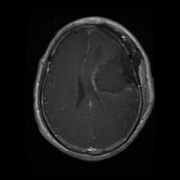
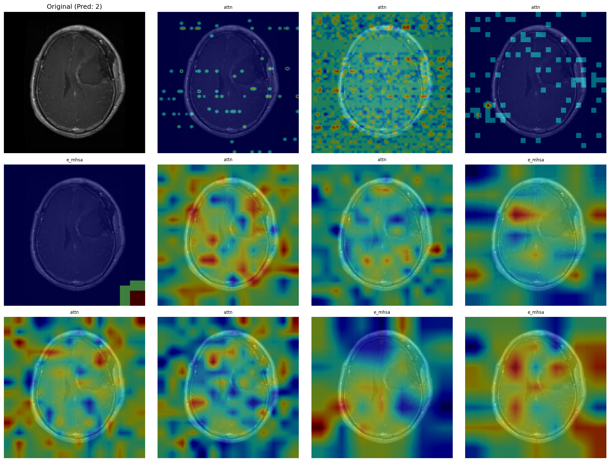
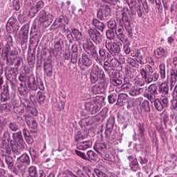

# MedViT-v2 Fine-tuning for Medical Image Classification

A deep learning project for fine-tuning **[MedViT-v2](https://github.com/Omid-Nejati/MedViTV2)** (Medical Vision Transformer) on various medical image classification datasets.

## Overview

This project provides a flexible pipeline for fine-tuning MedViT-v2, a hybrid transformer architecture optimized for medical imaging. It supports any HuggingFace image classification dataset and has been tested on brain tumor MRI and colorectal cancer histology datasets.

### Key Features

- **Hybrid Architecture**: MedViT-v2 combines CNNs and Transformers for optimal performance
- **Multi-Device Support**: Automatic detection for CUDA (NVIDIA), MPS (Apple Silicon), and CPU
- **Flexible Data**: Supports any HuggingFace image classification dataset
- **Comprehensive Metrics**: Accuracy, Precision, Recall, F1-score, AUC-ROC, etc.

## Supported Datasets

Any HuggingFace image classification dataset can be used. Tested datasets include:

| Dataset | Classes | Task |
|---------|---------|------|
| [PranomVignesh/MRI-Images-of-Brain-Tumor](https://huggingface.co/datasets/PranomVignesh/MRI-Images-of-Brain-Tumor) | 4 | Brain tumor classification (MRI) |
| [junyeong-nero/mini-NCTCRCHE100K](https://huggingface.co/datasets/junyeong-nero/mini-NCTCRCHE100K) | 9 | Colorectal cancer tissue classification (Histology) |

**Input**: 224×224 images

## Model Architecture

**MedViT-v2** uses a hybrid approach with Convolutional Stems and Hybrid Processing Blocks (combining Neighborhood Attention and Global Attention).

**Available Sizes**: `MedViT_tiny` (default), `MedViT_small`, `MedViT_base`, `MedViT_large`.

## Installation

**Requirements**: Python 3.13+, `uv` (recommended) or `pip`.

```bash
# Clone and install dependencies
git clone <repository-url>
cd medvit-finetuning
uv sync  # or: pip install -r requirements.txt
source .venv/bin/activate
```

## Usage

### Training

#### Quick Start
Train a `MedViT_tiny` model with default settings:
```bash
bash scripts/train.sh
```

#### Advanced Training
Customize parameters like model size, batch size, and dataset:

```bash
uv run python src/train.py \
    --model_name MedViT_small \
    --dataset PranomVignesh/MRI-Images-of-Brain-Tumor \
    --batch_size 16 \
    --epochs 30 \
    --pretrained True
```

**Training Arguments**:
| Argument | Description | Default |
|----------|-------------|---------|
| `--model_name` | Architecture (`MedViT_tiny`, `resnet50`, etc.) | `MedViT_tiny` |
| `--dataset` | HuggingFace dataset name | - |
| `--batch_size` | Training batch size | `32` |
| `--epochs` | Number of epochs | `10` |
| `--pretrained` | Use pretrained weights | `False` |

### Inference & Evaluation

Run inference on datasets with optional comprehensive evaluation metrics:

```bash
# Quick inference with comprehensive evaluation
bash scripts/inference.sh

# Basic inference (accuracy only)
uv run python src/inference.py \
    --model_name MedViT_tiny \
    --model_weights weights/MedViT_tiny_PranomVignesh_MRI-Images-of-Brain-Tumor.pth \
    --dataset PranomVignesh/MRI-Images-of-Brain-Tumor \
    --split test \
    --batch_size 32

# Comprehensive evaluation with all metrics
uv run python src/inference.py \
    --model_name MedViT_tiny \
    --model_weights weights/MedViT_tiny_PranomVignesh_MRI-Images-of-Brain-Tumor.pth \
    --dataset PranomVignesh/MRI-Images-of-Brain-Tumor \
    --split test \
    --batch_size 32 \
    --evaluate True
```

**Arguments**:
| Argument | Description | Default |
|----------|-------------|---------|
| `--model_name` | Model architecture | Required |
| `--model_weights` | Path to checkpoint file | Required |
| `--dataset` | HuggingFace dataset name | Required |
| `--split` | Dataset split | `test` |
| `--batch_size` | Batch size | `32` |
| `--evaluate` | Compute comprehensive metrics | `False` |
| `--save_results` | Save predictions locally | `True` |
| `--push_to_hub` | Push to HuggingFace Hub | `None` |
| `--private_hub` | Make Hub repo private | `False` |

**With `--evaluate True`**, computes comprehensive metrics:
- Accuracy, Precision, Recall, F1-score (overall & per-class)
- Specificity, AUC-ROC (overall & per-class)
- Confusion Matrix
- Support (samples per class)

**Output**:
- Predictions: `results/{model}_{dataset}_{split}.json` (when `--save_results True`)
- Metrics: `results/{model}_{dataset}_{split}_metrics.json` (when `--evaluate True`)

### Attention Map Visualization

Visualize attention maps from trained MedViT models to understand where the model focuses:

```bash
# Quick visualization
bash scripts/visualize.sh --image_path ./sample.jpg

# With custom checkpoint
bash scripts/visualize.sh \
    --image_path ./sample.jpg \
    --checkpoint_path ./weights/MedViT_tiny_brain_tumor.pth \
    --output_path ./attention_result.png
```

**Arguments**:
| Argument | Description | Default |
|----------|-------------|---------|
| `--image_path` | Path to input image | Required |
| `--checkpoint_path` | Path to model checkpoint | `./checkpoint/MedViT_tiny_*.pth` |
| `--model_name` | Model architecture | `MedViT_tiny` |
| `--num_classes` | Number of output classes | `4` |
| `--output_path` | Path to save visualization | `./attention_visualization.png` |
| `--cmap` | Colormap for attention overlay | `jet` |
| `--alpha` | Transparency of overlay (0-1) | `0.5` |
| `--no-show` | Do not display visualization window | - |

## Results

### Test Metrics (MedViT_tiny)

| Dataset | Accuracy | Precision | Recall | F1-Score | AUC-ROC |
|---------|----------|-----------|--------|----------|---------|
| MRI-Images-of-Brain-Tumor | 96.65% | 96.71% | 96.65% | 96.60% | 99.66% |
| mini-NCTCRCHE100K | 93.54% | 93.53% | 93.54% | 93.52% | 99.59% |

### Per-Class F1 Scores

**MRI-Images-of-Brain-Tumor**
| Class | F1-Score |
|-------|----------|
| glioma | 100.00% |
| meningioma | 92.31% |
| no-tumor | 97.00% |
| pituitary | 96.53% |

**mini-NCTCRCHE100K**
| Class | F1-Score |
|-------|----------|
| ADI | 100.00% |
| BACK | 99.05% |
| DEB | 92.44% |
| LYM | 98.36% |
| MUC | 91.95% |
| MUS | 90.08% |
| NORM | 93.33% |
| STR | 81.25% |
| TUM | 94.44% |

### Attention Map Visualization Examples

MedViT uses two types of attention: **Neighborhood Attention (local)** in LFP blocks and **E-MHSA (global)** in GFP blocks. Below are visualization examples showing where the model focuses when making predictions.

**Brain Tumor MRI Classification**

| Input Image | Attention Map |
|-------------|---------------|
|  |  |

**Colorectal Cancer Histology Classification**

| Input Image | Attention Map |
|-------------|---------------|
|  |  |

## Project Structure

```
medvit-finetuning/
├── src/
│   ├── models/               # MedViT-v2 architecture definitions
│   ├── train.py              # Training script
│   ├── inference.py          # Inference & evaluation script
│   ├── visualize_attention.py # Attention map visualization
│   ├── dataset_builder.py    # Dataset loading and preprocessing
│   └── utils.py              # Helper utilities
├── scripts/
│   ├── train.sh              # Training helper script
│   ├── inference.sh          # Inference helper script
│   └── visualize.sh          # Attention visualization script
├── notebooks/
│   └── visualize_attention_example.ipynb  # Interactive visualization notebook
├── assets/                   # Sample images and visualization results
├── weights/                  # Trained model checkpoints
└── results/                  # Predictions and metrics (JSON)
```
